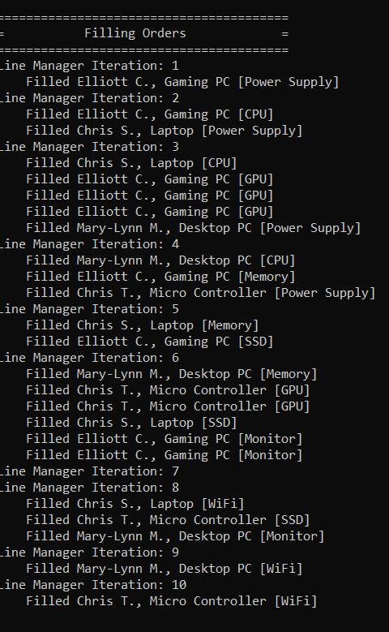

# simulated-assembly-line
The purpose of this project is to put C++ OOP skills to practice.

## Introduction
The project simulates an assembly line that fills customer orders from inventory. Each customer order consists of a list of items that need to be filled. 

The line consists of a set of stations. Each station holds an inventory of items for filling customer orders and a queue of orders to be filled. Each station fills the next order in the queue if that order requests its item and that item is still in stock. A line manager moves the customer orders from station to station until all orders have been processed. 

Any station that has used all of the items in stock cannot fill any more orders. Orders become incomplete due to a lack of inventory at one or more stations. 

At the end of all processing, the line manager lists the completed orders and the orders that are incomplete.

## Screenshot


## Run project locally
Install [Visual Studio Community.](https://visualstudio.microsoft.com/vs/community/)

Install [Oracle SQL Developer.](https://www.oracle.com/ca-en/tools/downloads/sqldev-v192-downloads.html)

Install [Oracle Instant Client SDK.](https://www.oracle.com/ca-en/database/technologies/instant-client/downloads.html)
```sh
Follow the instructions in the file "Project_Setup_Connecting" of this repo to configure Oracle Instant Client.
```
Clone the repo
   ```sh
   git clone https://https://github.com/trangntt-016/retail-app
   cd retail-app
   ```


